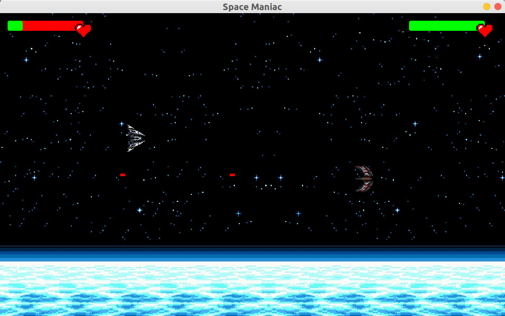
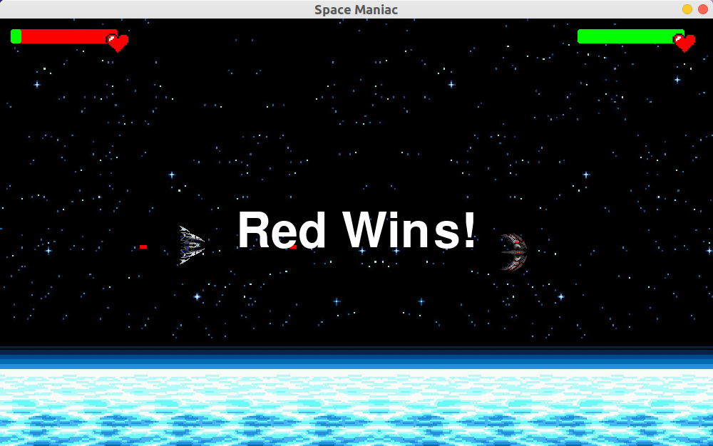

# Space Maniac
A 2D game, in which both players can play in single PC.

## Requirements
```
pip install -r requirements.txt
```
## How To Play
```
git clone https://github.com/iamAbhishekkumar/Space-Maniac
cd Space-Maniac
python3 main.py
```

- Shoot : Space-Bar
- Movement for Player 1 : WASD
- Movement for Player 2 : up,down,right,left

## Previews





**I have made this for learning pygame, If you like it, star this repo :upside_down_face:**

**If you find any issues, feel free to raise issues. Enjoy!:smile:**